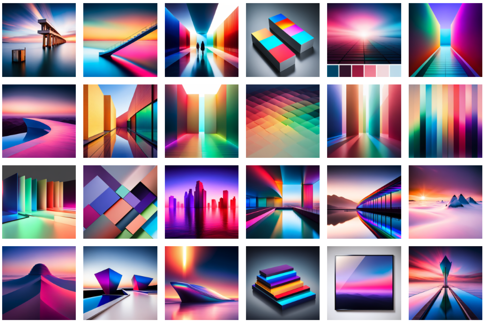

# ImagesBot
> AI Image Explorer



[ImagesBot](https://imagesbot.com/) is a Generative Image Search Engine. It combines the power of Image Generators with the power of Large Language Models.

**Explore a large image space with a few clicks.**

Here's how ImagesBot works:

- Enter any search query
- Query gets remixed into different styles, tastes, interpretations, etc..
- Click on the styles you like
- New remixes get added based on the styles you like
- Repeat. That's it!

Behind the scenes, ImagesBot takes your prompt and remixes it using an LLM like ChatGPT or LLaMa.

It starts with a broad search, finding many different kinds of images. Once you start clicking images you like, it performs a narrow search.

Over time ImagesBot converges many different image styles into a single image style. This is useful for

- Mood boards
- Brands
- Video Game assets
- Website graphics
- Iterative Image Generation
- and much more

ImagesBot is free to try at [imagesbot.com](https://imagesbot.com/), and is also open source. You can download this repository and run a local version.


## Setup

```bash
git clone https://github.com/themaximal1st/imagesbot.com.git
cd imagesbot.com
npm install
cp .env.template .env # edit .env
npm run dev
open http://localhost:3000
```


## Author

-   [The Maximalist](https://themaximalist.com/)
-   [@themaximal1st](https://twitter.com/themaximal1st)


## License

MIT